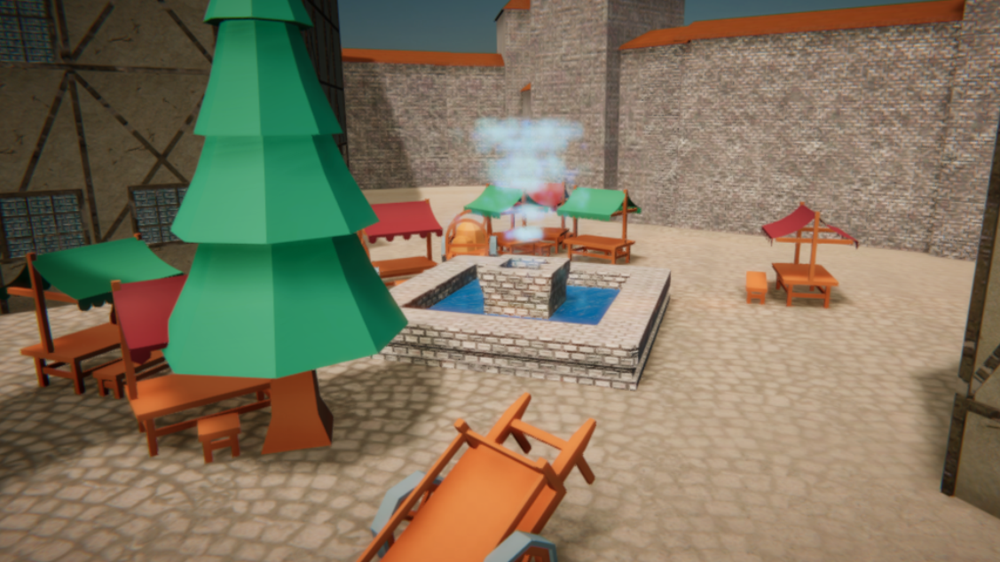

# Procedural Art
Repository for the Procedural Art course at Saxion where the task was to procedurally generate a city in the style of a chosen theme (in my case The Witcher 3's city center of Novigrad). 

[**Research document**](Github/docs/novigrad_visual_research.pdf)

## Top view

## Side view

## City markets

## Tooling

## Building blocks
